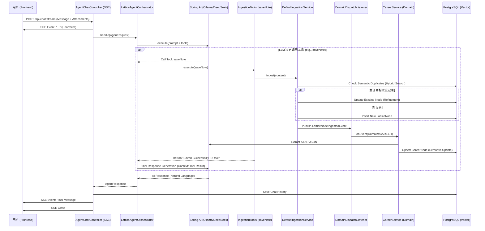

# Lattice AI Chat 功能技术实现与架构评审文档

## 1. 概述 (Overview)

本文档旨在详细描述 Lattice 平台中 AI 智能助手（AI Chat）功能的端到端实现。该功能集成了实时对话、文件上传、意图识别、RAG（检索增强生成）、自动工具调用（Function Calling）以及领域数据的自动化治理（Ingestion & Refinement）。

核心目标是实现一个“具备记忆生长能力”的个人数字孪生助手，不仅能回答问题，还能自动整理、分类并修正用户的非结构化生活数据。

## 2. 架构设计 (Architecture)

系统采用 **React + Spring Boot + Spring AI + PostgreSQL (pgvector)** 的技术栈。

### 2.1 交互流程图 (Call Chain)



## 3. 核心代码文件清单 (Key Components)

### 3.1 前端实现 (Frontend)
| 模块 | 文件路径 | 说明 |
| :--- | :--- | :--- |
| **Chat UI** | `web-react/pages/LatticeChat.tsx` | 聊天主界面。支持 SSE 流式接收、Markdown 渲染、文件上传 (`FormData`)、心跳保活。 |
| **Request** | `web-react/requestConfig.ts` | 统一请求配置，处理 JWT 鉴权和全局错误。 |
| **Types** | `web-react/services/lattice/types.ts` | 定义 `ChatMessage`, `AgentResponse`, `DashboardStats` 等接口。 |

### 3.2 后端接入层 (Controller Layer)
| 模块 | 文件路径 | 说明 |
| :--- | :--- | :--- |
| **Streaming API** | `lattice-oss/.../AgentChatController.java` | 核心入口。使用 `SseEmitter` 实现流式响应。**关键优化**：在异步任务开始时立即发送心跳帧，防止前端超时重试导致的任务重复执行。 |

### 3.3 AI 编排与代理层 (Agent Layer)
| 模块 | 文件路径 | 说明 |
| :--- | :--- | :--- |
| **Orchestrator** | `lattice-oss/.../LatticeAgentOrchestrator.java` | 协调层。封装了 Agent 执行逻辑，记录 TraceContext。 |
| **Core Logic** | `lattice-oss/.../LatticeAgentService.java` | 基于 Spring AI 实现。定义了 System Prompt（包含“结果反馈”、“主动补全”、“持续完善”原则）并注册 Tools。 |
| **Prompt Config** | `lattice-oss/.../application.yml` | 存储 Prompt Templates（如 `career-star`, `inbox-auto-classify`）。 |

### 3.4 工具与能力 (Tools & Capabilities)
| 工具名称 | 实现类路径 | 功能描述 |
| :--- | :--- | :--- |
| **saveNote** | `lattice-oss/.../IngestionToolsConfig.java` | 通用记录工具。调用 Ingestion 服务将非结构化文本存入知识库。 |
| **searchLattice** | `lattice-oss/.../KnowledgeToolsConfig.java` | RAG 检索工具。调用 Retrieval 服务搜索相关知识。 |
| **Domain Tools** | `lattice-oss/.../ToolFunctionConfiguration.java` | 包含 `createExpense` (记账), `scanReceipt` (OCR), `parseResume` (简历解析)。 |

### 3.5 数据治理与分发 (Ingestion & Dispatch)
| 模块 | 文件路径 | 说明 |
| :--- | :--- | :--- |
| **Ingestion Svc** | `lattice-oss/.../DefaultIngestionService.java` | **核心枢纽**。负责：1. 调用 AI 分类器；2. 生成向量；3. **通用层语义查重与更新**；4. 发布 `LatticeNodeIngestedEvent`。 |
| **Dispatcher** | `lattice-oss/.../DomainDispatchListener.java` | **事件监听器**。解耦 Ingestion 和 Domain Service。根据事件的 `DomainType` 将数据分发给 `CareerService` 或 `WealthService`。 |
| **Classifier** | `lattice-oss/.../AiDomainClassifier.java` | 使用 Few-Shot Prompting 将文本分类为 CAREER, WEALTH, BUILD 等领域。 |

### 3.6 领域服务与存储 (Domain & Repository)
| 模块 | 文件路径 | 说明 |
| :--- | :--- | :--- |
| **Career Svc** | `lattice-oss/.../CareerService.java` | 职业领域服务。包含 **垂直领域语义查重** (Cosine Similarity > 0.90) 和 STAR 结构化提取逻辑。 |
| **Vector Search** | `lattice-oss/.../LatticeNodeQueryRepositoryImpl.java` | 原生 SQL 实现混合检索。**关键修复**：增加了 `cast(? as vector)` 以解决 Hibernate 类型映射错误。 |
| **Vector Util** | `lattice-oss/.../PgvectorParameter.java` | 工具类。将 `List<Double>` 转换为 JSON String 格式，适配 PostgreSQL vector 插件。 |

## 4. 关键算法与机制 (Key Algorithms)

### 4.1 语义查重与智能更新 (Semantic Refinement)
为了避免用户反复讨论同一话题产生大量重复碎片，系统实现了“查重即更新”机制：

*   **算法**：余弦相似度 (Cosine Similarity)。
*   **阈值**：相似度 > **0.90**。
*   **逻辑**：
    1.  计算输入文本的 Embedding。
    2.  在数据库中检索 Top-1 最相似节点。
    3.  如果相似度超过阈值，视为**“对同一事物的补充或修正”**。
    4.  执行 `update` 操作（覆盖旧内容、更新元数据、重新生成 STAR 结构），而不是 `insert`。
    5.  返回旧节点的 ID，保持引用一致性。

### 4.2 混合检索 (Hybrid Search)
在 `LatticeNodeQueryRepositoryImpl` 中实现了加权混合检索：
```sql
select id, ..., 
       (0.7 * (1 - (embedding <=> :query_vector)) + 
        0.3 * coalesce((properties->>'score')::float, 0)) as score 
from lattice_nodes 
where domain = :domain
order by score desc
```
*   **向量得分 (0.7)**：基于语义相似度。
*   **属性得分 (0.3)**：基于元数据中的重要性标记（如有）。

### 4.3 自动分发 (Event-Driven Dispatch)
采用事件驱动架构解决循环依赖并实现解耦：
1.  `DefaultIngestionService` 仅负责通用层的处理，完成后发布 `LatticeNodeIngestedEvent`。
2.  `DomainDispatchListener` 监听该事件，根据 `DomainType` 将数据“投影”到垂直业务表（如 `lattice_career_nodes`）。
3.  这确保了数据既存在于“全脑记忆”（LatticeNode）中，又结构化地存在于“业务模块”（Career/Wealth）中。

## 5. 待优化项 (Future Improvements)

1.  **大模型响应延迟**：目前依赖本地模型推理，首字延迟较高（约 15s）。已通过 SSE 心跳解决连接超时问题，但用户等待感仍强。建议引入流式推理（Token Streaming）而非一次性返回。
2.  **多轮对话上下文**：目前 Agent 的 Prompt 主要基于当前输入和工具结果，对历史多轮对话的 Context Window 管理还需加强。
3.  **Prompt 管理**：部分 Prompt（如分类器）仍硬编码在 Java 代码中，建议全部迁移至 `application.yml` 或数据库配置中。

---
*文档生成时间: 2025年12月20日*
