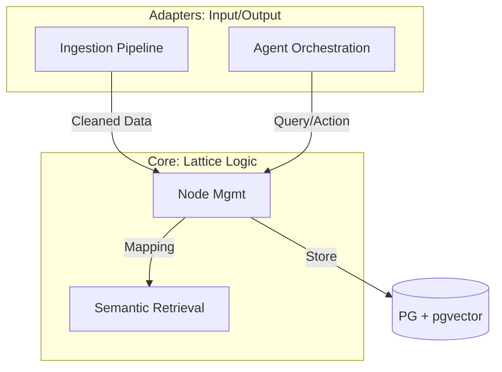

# 🏛️ Lattice (晶格) · 架构深研报告 (Architecture Deep Dive)

> **角色**: 首席软件架构师 (Principal Software Architect)  
> **版本**: v0.1  
> **日期**: 2025-12-19

## 1. 架构愿景与本质问题
Lattice 的架构目标是构建一个**具备演进能力的个人认知中枢**。其本质挑战在于：如何平衡人类生活的**混沌非结构化特征**与计算机处理的**结构化逻辑需求**。

我们通过 **“逻辑索引 (JSONB) + 语义索引 (Vector)”** 的混合模式，解决了这一矛盾。

---

## 2. 领域建模与上下文划分 (DDD)

基于领域驱动设计，Lattice 被划分为以下核心上下文：

### 2.1 限界上下文 (Bounded Contexts)
1.  **节点管理上下文 (Node Management)**: 维护原子的 `LatticeNode` 聚合根。
2.  **语义检索上下文 (Semantic Retrieval)**: 处理向量空间的相似度映射。
3.  **智能代理上下文 (Agent Intelligence)**: 负责推理、意图识别与工具编排。
4.  **数据摄取上下文 (Ingestion Pipeline)**: 负责外部噪声数据的清洗与结构化。

### 2.2 上下文映射图 (Mermaid)

---

## 3. 技术架构选型与权衡 (Trade-offs)

### 3.1 混合存储引擎：PostgreSQL (JSONB + pgvector)
*   **决策**: 放弃专门的向量数据库（如 Pinecone）或文档数据库（如 MongoDB），选择 PostgreSQL。
*   **权衡**:
    *   **优点**: **强事务一致性**。向量索引与元数据索引在同一个事务中更新，保证了“查出来的即是存在的”。
    *   **缺点**: 相比原生字段，JSONB 在超大规模（千万级）数据下的聚合性能稍逊，需通过 `GIN` 索引和 `Generated Columns` 弥补。

### 3.2 并发模型：Java 21 Virtual Threads (Loom)
*   **决策**: 全面拥抱虚拟线程。
*   **权衡**: Agent 任务涉及大量 I/O 等待（LLM 响应通常在秒级），使用虚拟线程可以用同步的代码风格写出异步的高性能表现，降低系统维护门槛。

---

## 4. 关键设计模式

### 4.1 Schema-on-Read (读时模式)
在 `lattice-core` 中，我们不预定义复杂的业务表。所有动态属性（如财务的 amount，DIY 的 materials）统一进入 `properties` (JSONB)。只有在应用层读取时，才根据 `domain` 字段转化为具体的领域对象。这赋予了系统极强的抗变化能力。

### 4.2 Tool-Use Agent (工具代理)
`lattice-agent` 不仅仅是一个聊天接口，它是一个 **Reasoning Loop**。它通过 `Spring AI` 的 `ToolCallback` 机制，按需调用本地 Service。
- **示例**: 当用户问“我上周在咖啡上花了多少钱？”，Agent 自动解析出财务查询参数，调用 `RetrievalService`，再对结果进行总结。

---

## 5. 性能与扩展性策略

1.  **混合分算策略**: 
    - 结构化过滤 (SQL `WHERE`): 解决“确定性”问题（如 `domain = 'FINANCE'`）。
    - 向量相似度 (`<=>`): 解决“相关性”问题。
    - 最终得分 = `alpha * 语义得分 + (1 - alpha) * 逻辑得分`。

2.  **索引优化计划**:
    - 为 JSONB 中的 `category`, `amount` 等热点字段建立索引。
    - 使用 `HNSW` 替换 `ivfflat` 以获得更快的近似搜索速度。

---

## 6. 后续演进方向
*   **多代理协作 (Multi-Agent)**: 引入专门负责财务审计的 Agent 和负责职业规划的 Agent。
*   **离线推理**: 探索接入 Ollama 以在敏感场景下实现纯本地数据处理。

---
*设计确认人: Principal Architect (Gemini Agent)*
