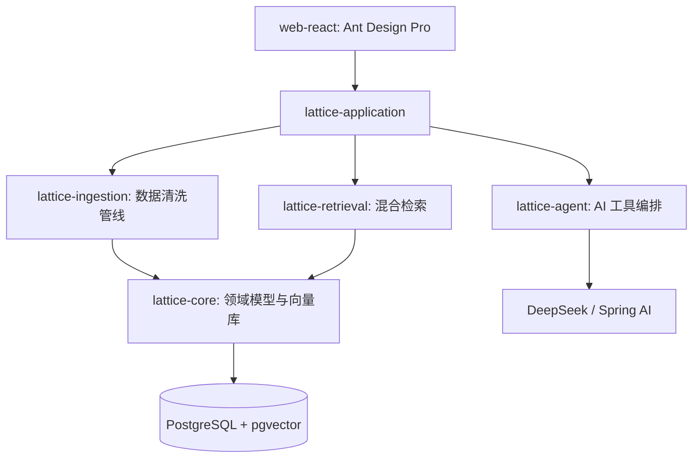

# 🏗️ Lattice (晶格) · 系统架构规划与协同设计指南 (Project Plan)

## 🧩 一、系统架构设计

Lattice 采用 **“三层双轨”** 架构：
- **三层**：展现层 (React 19)、业务编排层 (Spring Boot 3.3)、持久化层 (Postgres 16)。
- **双轨**：传统的 **结构化 CRUD 轨迹** 与 基于向量的 **RAG (检索增强生成) 轨迹** 并行。

### 1.1 模块依赖关系图

### 1.2 核心控制流：数据生命周期
1.  **捕获 (Capture)**: `lattice-ingestion` 通过 REST 接收非结构化输入。
2.  **语义化 (Semantic Processing)**: `lattice-agent` 调用 LLM 提取 JSONB 属性并生成 Embedding。
3.  **持久化 (Persistence)**: `lattice-core` 将数据与向量同步写入 `lattice_nodes` 表。
4.  **召回 (Recall)**: `lattice-retrieval` 执行混合查询（SQL Filter + Vector Similarity）。

---

## ⚙️ 二、模块定义与接口约定

### 2.1 `lattice-ingestion` (入库模块)
- **职责**: 负责将原始文本、PDF、API 同步数据（如 Firefly III）转化为系统可识别的 `LatticeNode`。
- **关键接口**: `IngestionService.process(rawText, sourceTag)`
- **依赖**: `lattice-agent` (用于元数据提取)。

### 2.2 `lattice-retrieval` (检索模块)
- **职责**: 实现高效率的混合搜索。
- **逻辑**: `Score = (SemanticSimilarity * 0.7) + (MetadataMatch * 0.3)`。
- **接口**: `SearchController` 暴露 `/api/v1/search`，支持 DSL 化的 JSONB 过滤器。

### 2.3 `lattice-agent` (智能代理模块)
- **职责**: 管理 Prompt 模板、工具函数（Tool Calling）及外部 AI 交互。
- **模式**: **Tool-Use 模式**。Agent 可以决定是否调用 `lattice-retrieval` 来辅助回答。

---

## 🧠 三、技术选型建议

| 维度 | 选型 | 理由 |
| :--- | :--- | :--- |
| **并发模型** | Java 21 Virtual Threads (Loom) | AI 接口调用多为 I/O 密集型，虚拟线程可大幅提升吞吐量。 |
| **向量检索** | pgvector (HNSW Index) | 避免引入专门的向量数据库，保持数据一致性与事务支持。 |
| **前端状态管理** | React Context + TanStack Query | 简化多级组件间的数据传递，实现优雅的缓存与自动重试。 |
| **AI 编排** | Spring AI 1.1.2 | 声明式 AI 接口集成，支持结构化输出（JSON Schema）。 |

---

## 🧪 四、测试与验证策略

### 4.1 质量保证流水线
1.  **单元测试**: `lattice-core` 必须保证 100% 的 JSONB 序列化/反序列化测试覆盖。
2.  **集成测试**: 使用 `Testcontainers` 启动真实的 PostgreSQL 镜像，验证 `ivfflat` 或 `hnsw` 索引下的检索准确度。
3.  **RAG 评测**: 引入 **"黄金测试集"**，对比 Agent 在不同 Prompt 下的输出一致性。

### 4.2 验证清单 (Checklist)
- [ ] 变更是否符合 `lattice-core` 的领域边界？
- [ ] 是否新增了 Flyway 迁移脚本？
- [ ] 新增的 JSONB 属性是否有对应的 GIN 索引优化？
- [ ] API 是否遵循 `requestConfig.ts` 定义的错误处理规范？

---

## 🪄 五、下一步行动建议

1.  **基础设施升级**: 确认 `docker-compose.yml` 中的 PostgreSQL 已正确安装 `pgvector` 扩展。
2.  **Agent 工具化**: 在 `lattice-agent` 中实现第一个真正意义上的 **Tool**: `FinanceAnalysisTool`，允许 AI 直接查询账单趋势。
3.  **前端可视化**: 在 `web-react` 中引入图谱组件（推荐 G6），展示节点间的“语义链条”。
4.  **自动化流水线**: 配置 GitHub Actions 在每次提交时运行 `./gradlew test` 以检测耦合度破坏。

---
*设计者: Lattice 系统架构代理*
*日期: 2025-12-19*
