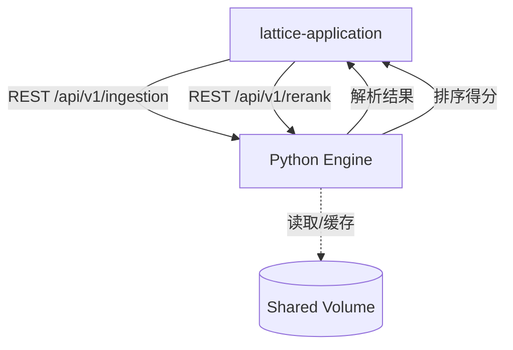
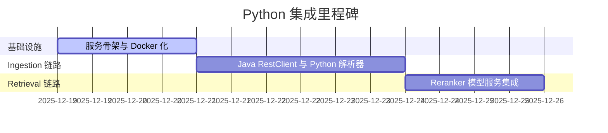

# 总体计划：Lattice Python Engine 深度集成

## 项目概述

### 项目背景
当前 Lattice 后端使用 Java 处理核心业务与向量存储，但在处理复杂的非结构化文件（PDF/Excel）解析以及高精度的语义重排序（Reranking）方面，Python 生态具备更成熟的工具链。通过打通 Java 与 Python 的集成链路，可显著提升系统的“第二大脑”处理能力。

### 项目目标
1.  **激活 Python 引擎**：将 `lattice-python-engine` 转化为可用的 FastAPI 微服务。
2.  **强化解析能力**：支持 PDF OCR 与复杂 Excel 提取，并能回传至 Java 端的 JSONB 存储。
3.  **提升召回精度**：在 RAG 链路中引入重排序模型，过滤向量检索的噪声。
4.  **全链路自动化**：实现 Docker Compose 下的一键启动与容器间自动服务发现。

---

## 可视化视图

### 系统逻辑图


### 模块关系矩阵
| 模块 | 主要输入 | 主要输出 | 责任角色 | 依赖 |
| --- | --- | --- | --- | --- |
| Python 基础设施 (plan_02) | 环境变量配置 | 稳定运行的 FastAPI 容器 | 架构师 | Docker 环境 |
| 增强摄取管线 (plan_05) | 原始字节流/文件路径 | 结构化 JSONB 属性 | 后端开发 | plan_02 |
| 重排序集成 (plan_08) | 候选节点列表 + 查询词 | Top-K 重排结果 | AI 开发 | plan_02 |

### 项目时间线


---

## 任务分解树

```
plan_01 总体计划
├── plan_02 Python 基础设施建设（预估 4 小时）
│   ├── plan_03 FastAPI 框架与依赖管理（预估 90 分钟）
│   └── plan_04 容器化编排与网络联通（预估 120 分钟）
├── plan_05 增强数据摄取管线（预估 8 小时）
│   ├── plan_06 Java 调用适配器实现（预估 180 分钟）
│   └── plan_07 Python 深度解析器实现（预估 300 分钟）
└── plan_08 检索重排序链路升级（预估 6 小时）
    ├── plan_09 Reranker 模型服务实现（预估 240 分钟）
    └── plan_10 检索管线后处理集成（预估 120 分钟）
```

---

## 技术栈

### 核心语言与框架
- **Python 3.11**: 核心逻辑。
- **FastAPI**: 异步 Web 框架，提供接口。
- **Uvicorn**: 高性能 ASGI 服务器。

### 关键库
- **PyMuPDF / Unstructured**: 深度解析 PDF/Docx。
- **Sentence-Transformers**: 加载 BGE/Cross-Encoder 模型。
- **Spring RestClient (Java)**: Java 端同步通讯。

---

## 验收标准

### 功能验收
1. [ ] Java 端上传 PDF，Python 引擎能成功返回解析后的 JSON。
2. [ ] 搜索结果经过 Python Rerank 后，排序分值发生变化。
3. [ ] 执行 `docker-compose up` 能够无干预启动所有服务。

### 性能验收
- [ ] 容器内 Rest API 延迟（非推理任务） < 50ms。
- [ ] Rerank 任务（10个节点）耗时 < 500ms（依赖硬件）。

---

## 风险评估
- **内存风险**：Python 模型加载可能导致容器 OOM。应对：设置 Docker Memory Limit 与 Swap。
- **网络风险**：Java 与 Python 服务间通信超时。应对：引入 Resilience4j 重试与断路器。

---
*项目统计*：总计划文件 10 个，预估总耗时 18 小时。
