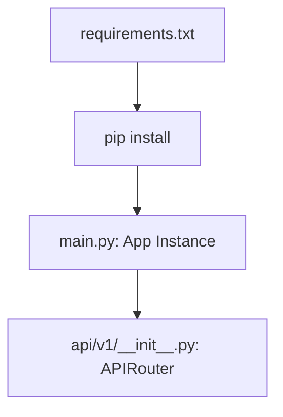

# 任务：FastAPI 框架与依赖管理

## 任务概述
在 `lattice-python-engine` 目录下初始化标准的 Python 项目结构，配置 Poetry 或 pip 依赖项。

---

## 执行步骤

### 步骤 1：目录结构初始化
- **操作**：创建 `src/api/v1` 目录，并在 `src` 下建立 `main.py`。
- **输入**：现有目录。
- **输出**：基础文件结构。

### 步骤 2：依赖声明
- **操作**：编写 `requirements.txt` 或 `environment.yml`。
- **输入**：需要的库清单。
- **核心依赖**：`fastapi`, `uvicorn`, `pydantic`, `loguru`。

### 步骤 3：核心骨架编写
- **操作**：编写 `main.py`，配置 FastAPI App 实例。
- **输出**：包含基础全局异常处理器与日志拦截器的应用。

---

## 可视化辅助

## 文件操作清单
- 创建 `lattice-python-engine/requirements.txt`
- 创建 `lattice-python-engine/src/main.py`
- 创建 `lattice-python-engine/src/api/v1/health.py` (健康检查接口)

---

## 验收标准
- [ ] 运行 `python -m uvicorn src.main:app` 无报错。
- [ ] CURL 健康检查接口返回 200。
