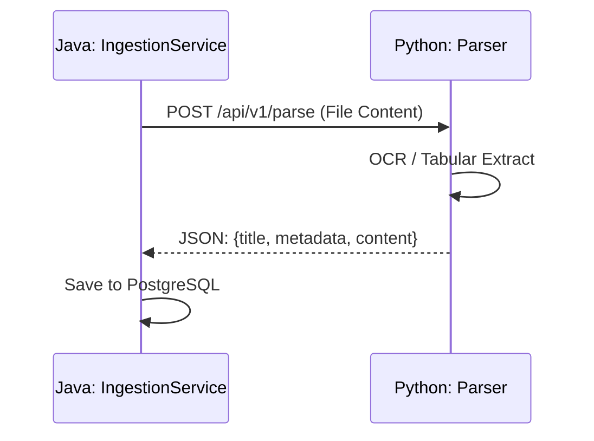

# 模块：增强数据摄取管线

## 模块目标
使 Lattice 能够处理复杂的 PDF、Excel 或长文本文件，通过 Python 引擎提取出高质量的结构化 JSON 属性。

---

## 依赖关系

### 前置条件
- **基础设施**：`plan_02` 已调通容器间网络。

### 后续影响
- **数据流**：解析结果将更新 `lattice_nodes` 表的 `properties` 字段。

---

## 子任务分解
- [ ] plan_06 - Java 调用适配器实现（预估 180 分钟）
- [ ] plan_07 - Python 深度解析器实现（预估 300 分钟）

---

## 可视化输出

### 摄取管线时序图

---

## 验收标准
- [ ] 系统支持解析包含复杂表格的 PDF 文件。
- [ ] 解析后的关键元数据（如日期、金额）能正确进入 JSONB 字段。
