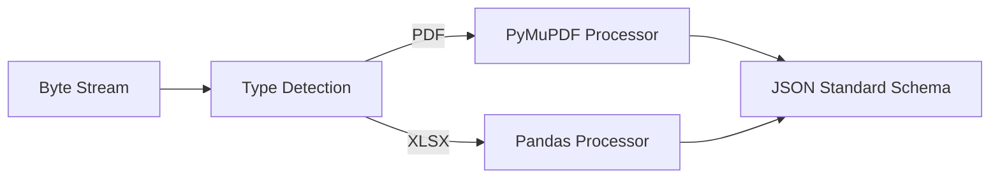

# 任务：Python 深度解析器实现

## 任务概述
在 Python 引擎中实现基于 `PyMuPDF` 或 `Unstructured` 的解析逻辑，并暴露 REST 接口。

---

## 依赖关系
- **关键库**：`PyMuPDF`, `pandas` (处理 Excel)。

---

## 执行步骤

### 步骤 1：路由定义
- **操作**：在 `api/v1/ingestion.py` 中定义 `@app.post("/parse")` 接口。

### 步骤 2：PDF 逻辑实现
- **操作**：编写文本提取、页码处理逻辑。
- **难点**：多栏布局识别与简单的表格重建。

### 步骤 3：数据清洗
- **操作**：去除解析过程中的乱码、非必要空格，结构化输出。

---

## 可视化辅助

---

## 验收标准
- [ ] 解析 10 页 PDF 的平均耗时在 2s 以内。
- [ ] 文本召回率（相比原始文本） > 95%。
