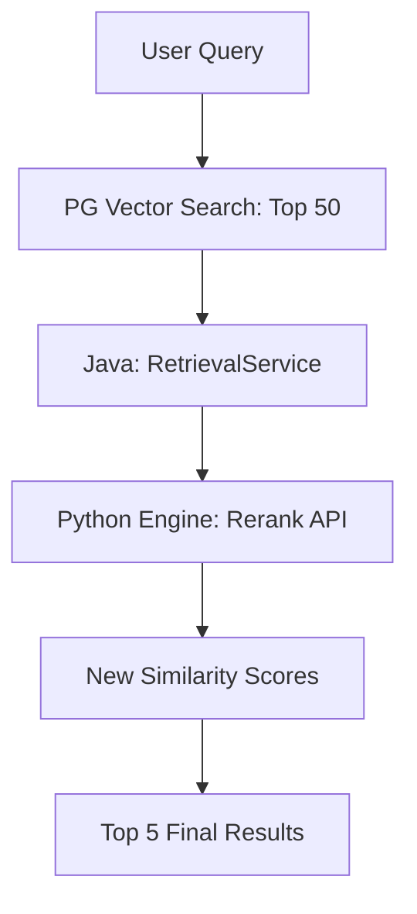

# 模块：检索重排序链路升级

## 模块目标
在向量检索（粗排）之后，引入 Python 引擎的 Cross-Encoder 模型进行重排序（精排），解决向量检索在关键词匹配上的弱点。

---

## 依赖关系

### 前置条件
- **模型准备**：需要选择轻量级的重排模型（如 `BAAI/bge-reranker-base`）。

---

## 子任务分解
- [ ] plan_09 - Reranker 模型服务实现（预估 240 分钟）
- [ ] plan_10 - 检索管线后处理集成（预估 120 分钟）

---

## 可视化输出

### RAG 检索管线示意图

---

## 验收标准
- [ ] 针对语义相近但关键词不同的查询，重排序后 Top-1 结果的准确性提升。
- [ ] 重排序环节具备开启/关闭配置。
